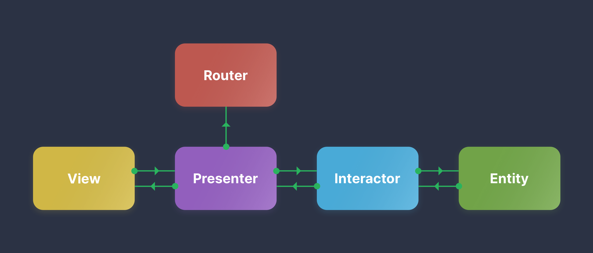
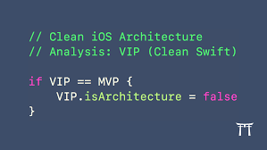

# UI Design Patterns

* See the 'Tag' section for each pattern source code 

🟢 MVC(Apple MVC approach):

The model-view-controller (MVC) design pattern specifies that an application consists of a data model, presentation information, and control information. The pattern requires that each of these be separated into different objects.

  
Multi-MVC:

    consist of multiple MVCs in collaboration
  

🟢 MVVM(implement MVVM approach):

Model-View-ViewModel (MVVM) is a software design pattern that is structured to separate program logic and user interface controls. MVVM is also known as model-view-binder and was created by Microsoft architects Ken Cooper and John Gossman.
  

🟢 MVP:

The MVP pattern is similar to the MVC pattern. It is derived from the MVC pattern, wherein the controller is replaced by the presenter. This pattern divides an application into three major aspects: Model, View, and Presenter. The Model represents a set of classes that describe the business logic and data.

1- Bidirectional-MVP:

          implement a bidirectional MVP communication  approach

2- Bidirectional-Abstraction-MVP:

          implement a bidirectional MVP communication approach using Abstraction in between 
    
3- Unidirectional-MVP:

          implement a unidirectional MVP communication approach

🟢 VIPER(iOS implementation of Clean Architecture): 

  It's MVP + some extra classes and trying to solve the 'class dependency' issue and 'testability'.
  

  ⚠️ Warning:
            
    These are UI Design Patterns,
    not your App architecture because we may end up with 'Clean Code' but spaghetti Architecture,
    Architecture is more about the 'Modular dependency' issue rather than the class dependency issue.

